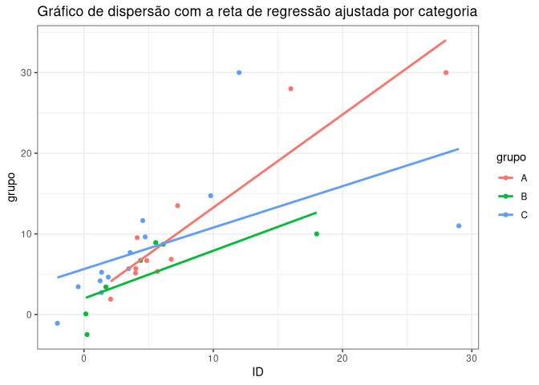
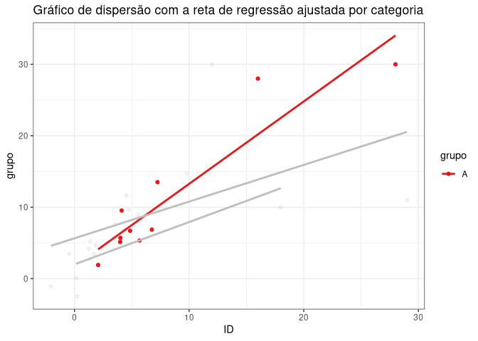
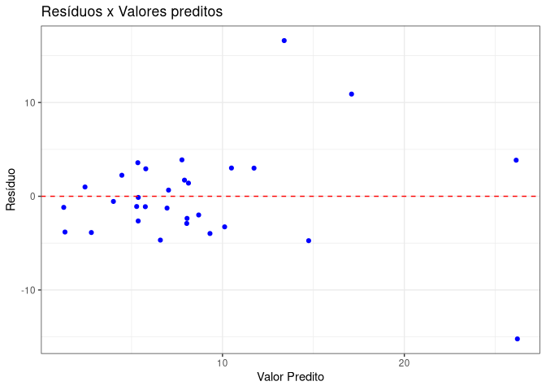
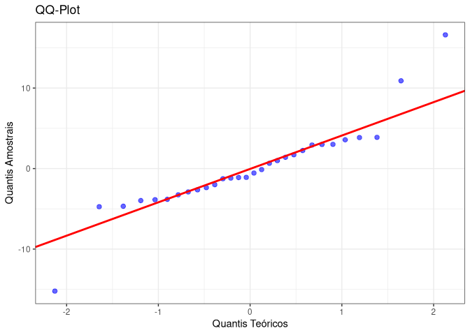

# API_Regressao_Linear

API desenvolvida como parte das atividades realizadas na disciplina de
ME918-2S-2024 (Produto de Dados) do curso de Estatística da UNICAMP.

# Introdução

A `API_Regressao_Linear` é uma interface que permite a interação do
usuário com um banco de dados, possibilitando: adição, modificação e
remoção de observações. Além disso, também torna possível ajustar um
modelo de regressão linear ($y_i = \beta_0 + \sum_{i=1}^p\beta_i x_i$),
disponibilizando as estimativas dos parâmetros do modelo, suas
significâncias estatísticas, predições para novos dados e gráficos de
dispersão do modelo ajustado e dos resíduos.

Ela foi criada e desenvolvida a partir do pacote `plumber` do R (e
testada através do `Swagger`) que, define uma estrutura de API a partir
de rotas, facilitando a implementação e a verificação com testes para
validação do comportamento.

# Rotas

As rotas implementadas foram:

- `/data/add_row`: Adicionar uma nova observação por requisição.
  Necessário fornecer os argumentos `x`, `grupo` e`y`;
- `/data/change_row`: Modifica uma única observação por requisição.
  Necessário fornecer: `ID`, `x`, `y` e `grupo`;
- `/data/delete_row`: Exclui observações com base na variável `ID`. As
  observações podem ser excluídas uma a uma, por meio de intervalos ou
  por meio de um vetor de índices;
- `/fit/param`: Fornece as estimativas dos parâmetros da regressão em
  formato JSON;
- `/fit/residuals`: Retorna os resíduos da regressão em formato JSON;
- `/fit/p_values`: Informa a significância estatística dos parâmetros em
  formato JSON; `/fit/pred`: Realiza predição para novas observações,
  retornando em formato JSON. Pode fazer predição para múltiplas
  observações novas;
- `/plot/lm`: Gera gráfico de dispersão com a reta de regressão
  ajustada. Além disso, o argumento opcional `focus` destaca um ou mais
  grupos indicados;
- `/plot/residuals`: Realiza a requisição do gráfico de resíduos da
  regressão contra os valores preditos;
- `/plot/residuals_qq`: Realiza a requisição do gráfico QQ-plot.

## Uso

Para exemplificar, considere o seguinte banco de dados simulado com
cinco observações:

    ##  ID    x grupo    y    momento_registro
    ##   1 5.35     B 6.43 2026-03-03 17:14:23
    ##   2 6.31     A 8.88 2026-03-03 17:14:23
    ##   3 6.74     B 9.64 2026-03-03 17:14:23
    ##   4 3.74     C 7.26 2026-03-03 17:14:23
    ##   5 3.72     A 3.66 2026-03-03 17:14:23

onde:

- `ID`: identificador da observação;
- `x`: variável preditora númerica;
- `grupo`:variável preditora categórica;
- `y`:variável resposta;
- `momento_registro`: horário em que a observação foi gerada.

### Dados

Adicionaremos uma linha ao banco apresentado anteriormente por meio da
rota `/data/add_row`. Considerando a requisição
`/data/add_row?x=5&grupo=A&y=10` (`x = 5`, `grupo = A`, `y = 10`):

    ##  ID    x grupo     y    momento_registro
    ##   1 5.35     B  6.43 2026-03-03 17:14:23
    ##   2 6.31     A  8.88 2026-03-03 17:14:23
    ##   3 6.74     B  9.64 2026-03-03 17:14:23
    ##   4 3.74     C  7.26 2026-03-03 17:14:23
    ##   5 3.72     A  3.66 2026-03-03 17:14:23
    ##   6 5.00     A 10.00 2026-03-03 17:14:23

Modificaremos uma linha por meio da rota `/data/change_row`. Se o
interesse é alterar a observação de `ID = 5` para `x = 5`, `grupo = C` e
`y = 15`, tem-se que a requisição é
`/data/change_row?ID=5&x=5&grupo=C&y=15`.

    ##  ID    x grupo     y    momento_registro
    ##   1 5.35     B  6.43 2026-03-03 17:14:23
    ##   2 6.31     A  8.88 2026-03-03 17:14:23
    ##   3 6.74     B  9.64 2026-03-03 17:14:23
    ##   4 3.74     C  7.26 2026-03-03 17:14:23
    ##   5 5.00     C 15.00 2026-03-03 17:14:23
    ##   6 5.00     A 10.00 2026-03-03 17:14:23

Faremos a exclusão utilizando as três formas mencionadas por meio da
rota `/data/delete_row`:

- Forma 1: Removendo uma única observação. Suponha que deseja-se excluir
  a linha com `ID = 1`, então, a requisição para isso é
  `/data/delete_row?ID=1`.

<!-- -->

    ##  ID    x grupo     y    momento_registro
    ##   2 6.31     A  8.88 2026-03-03 17:14:23
    ##   3 6.74     B  9.64 2026-03-03 17:14:23
    ##   4 3.74     C  7.26 2026-03-03 17:14:23
    ##   5 5.00     C 15.00 2026-03-03 17:14:23
    ##   6 5.00     A 10.00 2026-03-03 17:14:23

- Forma 2: Sequência de observações. Em certos casos, é preferível
  excluir uma sequência de observações, isso pode ser feito por meio da
  sintaxe `INICIO:FIM`. Considere excluir das três primeiras observações
  (`1:3`), então a requisição é dada por `/data/delete_row?ID=1%3A4`.

<!-- -->

    ##  ID    x grupo     y    momento_registro
    ##   4 3.74     C  7.26 2026-03-03 17:14:23
    ##   5 5.00     C 15.00 2026-03-03 17:14:23
    ##   6 5.00     A 10.00 2026-03-03 17:14:23

- Forma 3: Vetor de posições. Por fim, também é possível utilizar
  vetores, como `(1,3,5)`. Considerando o vetor anterior, a requisição é
  dada por `/data/delete_row?ID=1%2C3%2C5`.

<!-- -->

    ##  ID    x grupo     y    momento_registro
    ##   2 6.31     A  8.88 2026-03-03 17:14:23
    ##   4 3.74     C  7.26 2026-03-03 17:14:23
    ##   6 5.00     A 10.00 2026-03-03 17:14:23

### Inferência

Desta etapa em diante, o banco de dados simulado foi aumentado para 30
observações. Com isso, através da rota `/fit/param`, temos os seguintes
parâmetros estimados:

    ## {
    ##   "beta_0": [5.0281],
    ##   "beta_1": [0.7544],
    ##   "beta_2": [-3.8682],
    ##   "beta_3": [-0.6875],
    ##   "QME": [32.2284]
    ## }

Exibindo apenas os 10 primeiros resíduos com a requisição dada por
`/fit/residuals`:

    ## [-0.553,3.0135,1.7213,-2.3593,-1.2632,-1.1856,-3.868,-2.9005,-3.9731,-2.6392]

P-valores obtidos pela rota `/fit/p_values`:

    ## {
    ##   "beta_0": [5.0281],
    ##   "beta_1": [0.7544],
    ##   "beta_2": [-3.8682],
    ##   "beta_3": [-0.6875],
    ##   "QME": [32.2284]
    ## }

Fazendo predição de `(x = 10, grupo = B)` pela rota `/fit/pred`, o que
gera a requisição `/fit/pred?x=10&grupo=B`, resultando em:

    ## [16.2475]

Além disso, essa rota pode retornar múltiplas predições. Por exemplo,
considere os pares `(x = 10, grupo = A)` e `(x = 20, grupo = B)`, então,
é possível fazer a predição de ambas observações por meio da requisição
`/fit/pred?x=10%2C20&grupo=A%2CB`, obtendo:

    ## [12.5719,16.2475]

### Gráficos

Por meio da rota `/plot/lm`, tem-se o gráfico:

Além disso, também é possível focar em um grupo específico, por exemplo,
o grupo `A`. Então a chamada é `/plot/lm?focus=A`. Além disso, mais de
um grupo pode ser especificado utilizando a vírgula para separá-los.

Utilizando a chamada `/plot/residuals`, realiza-se a requisição do
gráfico de resíduos da regressão contra os valores preditos obtendo:

Por fim, o gráfico QQ-plot pode ser requisitado através de
`/plot/residuals_qq`, obtendo:

